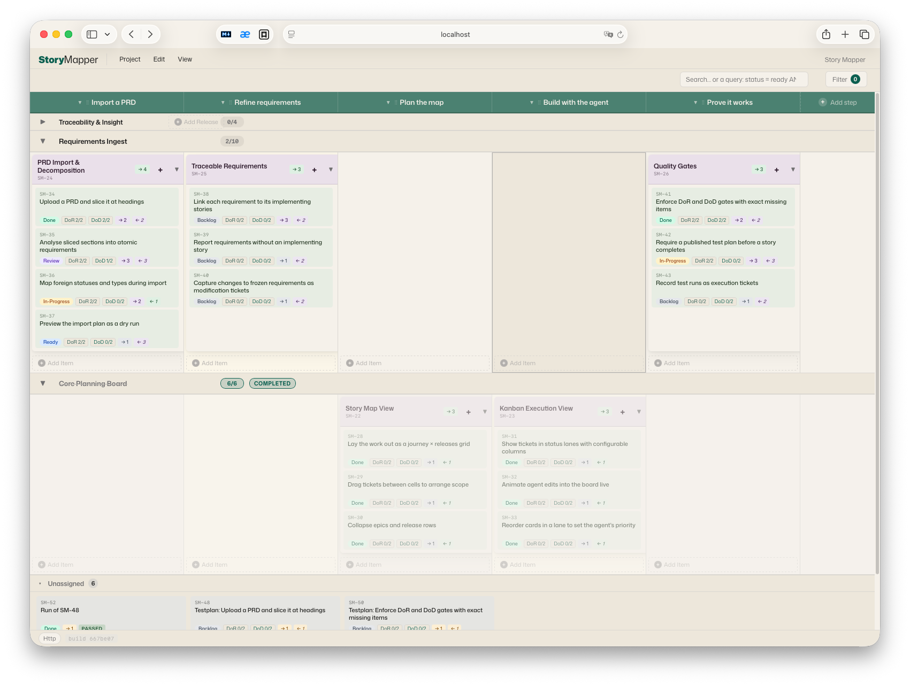

# Storymapper

**A User Story Map + Kanban board that a human and an AI coding agent plan
together — the same backlog, live, from a browser and from an MCP client.**

Storymapper is one Node.js package that ships three things:

1. **A browser UI** — a User Story Map (process steps × releases, with epics and
   stories in the cells), a Kanban board, plus table, dependency-graph,
   requirements and settings views. Plain HTML + modular JavaScript, no build step.
2. **An HTTP + WebSocket server** — persists every project in SQLite with a full
   per-project revision history, and pushes changes to connected browsers within
   ~100 ms.
3. **An MCP server** (stdio) — exposes ~70 tools so Claude Desktop / Claude Code
   can read and edit the very same data. Anything the agent does appears live in
   the human's browser with a highlight-and-move animation; anything the human
   edits flows back to the agent on its next read.

The result is a **shared planning surface**: the agent isn't writing to a
database the human can't see — the two work the same board in real time.



---

## Why it exists

Planning AI-assisted development breaks down when the plan lives in one place and
the work in another. Storymapper makes the plan a live, bidirectional artifact:

- The agent proposes a structure — epics, stories, releases, dependencies — and
  you watch it appear and rearrange it by hand.
- **Definition of Ready / Definition of Done are first-class and enforced.** Each
  project defines DoR/DoD checklists (global items + per-ticket-type overrides).
  An agent *cannot* move a ticket to `done` while a required DoD item is
  unchecked — the tool returns a structured error listing exactly what's missing.
- A configurable **workflow engine** (Jira-style statuses, categories, named
  transitions with source restrictions and gates) and a **Kanban board mapping**
  (N statuses → 1 column) let you model your own process, not a fixed one.
- Every change is a **revision** you can inspect and restore.

## Design principles

- **Zero build.** No bundler, no transpiler, no TypeScript. The browser loads
  classical `<script src>` modules; the server runs the same files under Node via
  a UMD wrapper. Clone and run.
- **One source of truth for pure logic.** All domain logic (normalization,
  operations, the workflow/governance engines, graph algorithms) lives in
  `shared/core.js` and is *symlinked* into the frontend and *re-exported* by the
  server — the same code runs in the browser, the HTTP server and the MCP server,
  with no mirror step to drift.
- **Raw HTTP, no framework.** `http.createServer` + manual routing. Small,
  readable, dependency-light.
- **Synchronous SQLite** via `better-sqlite3`, atomic per-save transactions, a
  per-project mutex, and count-bounded revision retention.
- **Single-user, local-first.** One person plus their agent on one machine. See
  the security model below.

For the full picture — layering, data model, live-sync mechanism, testing
approach and deliberate non-goals — see **[ARCHITECTURE.md](ARCHITECTURE.md)**.

---

## Requirements

- **Node.js ≥ 20** (developed and tested on 20 and 22; Node 18 is end-of-life).
- `better-sqlite3` is a native module. Prebuilt binaries cover mainstream
  platforms (macOS / Linux / Windows on x64 + arm64 for supported Node
  versions), so `npm install` usually just works. On an unsupported
  platform/Node combination it compiles from source and needs a C/C++ toolchain
  (Xcode Command Line Tools, `build-essential`, or the Windows build tools).

## Install

```sh
git clone <your-fork-url> storymapper
cd storymapper
npm install
```

## Run the browser UI

```sh
npm start
# → http://localhost:8770/   (data in ./.storymap-data)
# → Ctrl-C to stop
```

Open <http://localhost:8770/>. The page probes `/api/health` on its own origin
and uses the HTTP backend automatically — no URL parameter needed. If it is
served from somewhere else it falls back to `localStorage`; you can pin a
specific server with `?api=<url>`. The page must be served from a loopback origin
(`localhost` / `127.0.0.1`) — `file://` is not supported (see the security model).

## Connect it to your Claude (one command per surface)

Storymapper reaches an agent through two parts: the **MCP server** (the tools)
and the companion **skill** (the working method — the DoR/DoD contract, the
workflow, when to pull vs. push). Installing one does **not** install the
other, so the setup commands below always install **both**:

| Surface | Command | What remains |
|---|---|---|
| **Claude Code** (CLI) | `npm run install-code` | restart your Claude Code session |
| **Claude Desktop** | `npm run install-desktop` | upload `dist/storymap-skill.zip` under **Settings → Capabilities → Skills**, then fully restart the app — and use a **Chat** (see below) |
| **claude.ai in the browser** | — | works with remote connectors only; it cannot reach a local server. Use Claude Code or Claude Desktop. |

`npm run install-code` copies the skill to `~/.claude/skills/storymap` and
registers the MCP server via `claude mcp add` (user scope). If the `claude`
CLI is unavailable it prints the ready-made command instead.

`npm run install-desktop` writes the server entry into the platform's
`claude_desktop_config.json` (existing entries survive, a `.bak` backup is
kept) and builds the skill zip. The skill store in Claude Desktop is managed
by the app, so the one upload in the UI is the single step no script can do
for you.

> **Chat, not Cowork.** Claude Desktop reaches local MCP servers from **Chat**
> conversations only — in **Cowork** mode the Storymapper tools are not
> available. If Cowork is your default surface, switch to a Chat; when the
> tools don't show up, this is the first thing to check.

Both commands are idempotent — re-run them after pulling a new Storymapper
version. `--data-dir=DIR` overrides the data directory (default:
`<repo>/.storymap-data`).

### Manual setup (other MCP clients, other harnesses)

Any stdio MCP client can run the server with this shape:

```json
{
  "mcpServers": {
    "storymapper": {
      "command": "node",
      "args": [
        "/absolute/path/to/storymapper/server/index.js", "mcp",
        "--data-dir=/absolute/path/to/storymapper/.storymap-data"
      ]
    }
  }
}
```

The skill package (`npm run package-skill` → `dist/storymap-skill.zip`) is
plain Markdown — `storymap/SKILL.md` plus its `reference/` files. For
harnesses like Codex, unpack it wherever instructions live and point the
harness at it, e.g. from an `AGENTS.md`:

```md
Before planning work on the Storymapper board, read storymap/SKILL.md
(and the reference/ files it names) and follow that working method.
```

Point `--data-dir` at the **same** directory the HTTP server uses. Both processes
can run concurrently against one SQLite file (WAL mode + a busy-timeout);
the HTTP server relays every MCP write to connected browsers over WebSocket.

> Only one `storymapper server` may run per data directory (a PID lock refuses a
> second; `--force` takes over a stale lock after a crash). The MCP process is
> exempt and may always share the data dir.

## Security model (single-user, local)

Storymapper is a **local single-user tool** — one human plus their agent on one
machine. There is deliberately no authentication layer:

- The server binds to `localhost` by default. **Do not expose it on a
  non-loopback interface** (`--host=0.0.0.0`, a reverse proxy, a Docker port map)
  without putting your own authentication in front — anyone who can reach the
  port can read and write every project.
- CORS is locked to loopback origins: cross-origin browser requests get no
  `Access-Control-Allow-Origin` and mutating methods are rejected — this stops a
  random website you visit from driving your local API. WebSocket upgrades are
  origin-checked the same way.
- Served HTML carries a Content-Security-Policy; all responses send
  `X-Content-Type-Options: nosniff`.
- `X-Actor-*` headers are **attribution, not authentication** — they label who
  did what in the revision history and are not verified.
- Verified identity, remote-binding token gates and RBAC are a deliberate later
  stage; the authorization seam (`server/identity.js`) is already in place.

## Testing

```sh
npm test          # ≈1800 assertions, plain Node scripts, no test framework
```

The suite is a homegrown runner (`tests/run.js`) over `tests/test-*.js`: pure
unit tests, storage/mutex/revision tests, in-process and stdio MCP round-trips,
JSDOM renderer tests, and a real-server end-to-end test. CI runs it on Node 20
and 22. Tests only ever touch temporary directories — running them never
touches your data.

## License

Licensed under the **Apache License 2.0** — see [LICENSE](LICENSE) and
[NOTICE](NOTICE).
